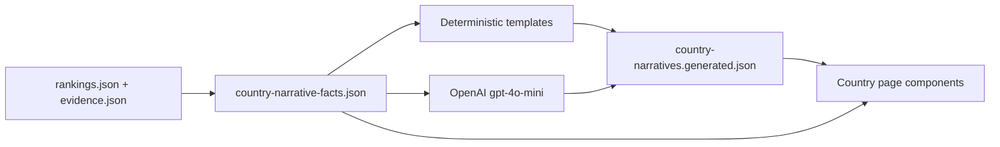

# Country page narratives

Evidence-grounded editorial copy for GIRAI country pages (`/countries/[iso3]`). Replaces score-tier templates with per-country narratives derived from the 2026 dataset.

## Summary for reviewers

| Before | After |
|--------|--------|
| One of five generic paragraphs per score band | Per-country copy from ranks, deltas, indicators, and evidence |
| Tier labels (“Advanced”, “Developing”) | Rank-based framing (“11th globally”, “4th in Labour and Skills”) |
| Pillar callouts repeated tier prose | Synthesised callouts linking contribution %, checklist bullets, and evidence |

## How copy is produced



### 1. Fact bundles (`country-narrative-facts.json`)

Structured JSON per country, built from committed dataset artifacts. No LLM. Includes:

- Hero: ranks (global, regional, income group), URAI penalty, strongest/weakest dimensions, framework vs implementation, pillar mix, evidence counts
- Per dimension: score, ranks, regional delta, top/bottom indicators, evidence titles
- Per pillar: score, median comparison, contribution %, checklist bullets, evidence titles

### 2. Deterministic narratives

Slot-filled sentences from fact bundles. Used as:

- Fallback when generated copy is missing
- CI golden strings
- Output when `OPENAI_API_KEY` is not set

### 3. LLM narratives (`country-narratives.generated.json`)

When `OPENAI_API_KEY` is set, `pnpm build:narratives` calls **gpt-4o-mini** once per country. The model receives only the fact bundle and must return JSON for hero + 5 dimensions + 3 pillars.

Post-generation validation:

- Word limits
- No tier labels
- Hero must include country name and GIRAI score
- Quoted evidence titles must appear in `allowedTitles`

Failed validation → deterministic copy for that country.

### 4. Runtime resolution (ADR 0004)

`getCountryNarrative(scope, iso3, slug?)` in `src/lib/country-narratives/`:

1. Generated artifact (today)
2. Deterministic from fact bundles (computed at runtime from same logic as build)
3. Neutral placeholder

Sanity CMS overrides will slot in at step 1 when integrated.

## Where narratives appear

| Section | Scope | Component |
|---------|--------|-----------|
| Hero | `hero` | `CountryScoreHero` |
| Five dimensions | `dimension` × slug | `CountryPerformanceOverview` |
| What Drives — pillar callout | `pillar` × slug | `CountryPerformanceDrivers` |

Pillar **checklist bullets** remain evidence-count driven (`country-pillar-highlights.json`). Callout paragraphs **synthesise** bullets + contribution bar.

## Evidence naming rules

- **Short unique titles** (≤72 chars): quoted by name in prose
- **Long or repetitive titles**: generic phrasing (“documented national AI strategy”, “3 documented frameworks”)
- **URAI / misuse**: mentioned in hero when `uraiCount > 0`

## Developer workflow

```bash
# After any dataset change
pnpm build:data

# Regenerate narratives — pick a mode:
pnpm build:narratives:deterministic   # slot-based copy only (no API)
pnpm build:narratives:llm             # force OpenAI gpt-4o-mini
pnpm build:narratives                 # auto: LLM if OPENAI_API_KEY is set, else deterministic
```

### Mode selection

| Method | Effect |
|--------|--------|
| `pnpm build:narratives:llm` | Always call OpenAI; fails if no key |
| `pnpm build:narratives:deterministic` | Never call OpenAI |
| `pnpm build:narratives` | **Auto** — LLM when `OPENAI_API_KEY` is present |
| `NARRATIVE_SOURCE=llm` | Same as `:llm` |
| `NARRATIVE_SOURCE=deterministic` | Same as `:deterministic` |
| `--llm` / `--deterministic` | CLI flags override `NARRATIVE_SOURCE` |

The build script loads **`.env.local`** and **`.env`** from the repo root automatically (shell variables take precedence). Put `OPENAI_API_KEY=sk-...` in `.env.local` — do not commit it.

```bash
# Examples
pnpm build:narratives:llm
NARRATIVE_SOURCE=deterministic pnpm build:narratives
```

**Outputs:**

| File | Purpose |
|------|---------|
| `src/data/2026/generated/country-narratives.generated.json` | Shipped copy (commit to repo) |
| `src/data/2026/generated/country-narrative-facts.json` | Review / debug fact bundles |
| `docs/country-narratives-index.md` | Auto-generated country index for client |

`build:narratives` is **not** wired into `prebuild` — regeneration is an explicit, reviewable step (ADR 0006).

## Client review

- **Index:** [country-narratives-index.md](./country-narratives-index.md) — built metadata + country table
- **Legacy tier templates:** [country-page-narrative-templates.md](./country-page-narrative-templates.md) — superseded for country pages; kept for historical reference
- **Pilot comparisons:** Brazil and Singapore were used to compare deterministic vs LLM-style copy during design

## Decisions (2026-06)

1. **LLM:** gpt-4o-mini at build time; artifact committed; production does not call OpenAI
2. **Evidence titles:** specific when short, generic when long/repetitive
3. **URAI:** included in hero when penalty or misuse evidence applies
4. **Pillar callouts:** synthesise (not removed)
5. **Review:** dev-regenerated artifacts + docs index; client reviews diffs on `build:narratives`
6. **Framing:** rank-based only — no tier labels on country page narratives

---

*GIRAI Global Index 2026*
