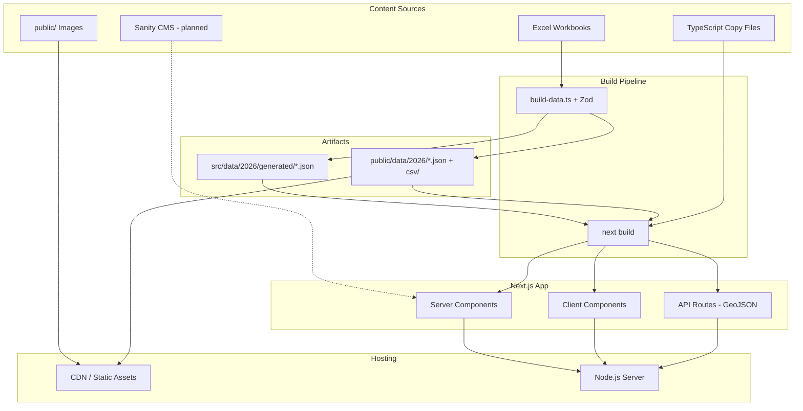

# GIRAI Global Index — Tech Stack & Infrastructure

High-level overview of the frontend, UI, data pipeline, content model, and compatible hosting for this project.

---

## Overview

GIRAI is a **data-driven marketing/research site** for the Global Index on Responsible AI. It is a **Next.js full-stack web app** with a **static-first architecture**: no database, no backend services beyond what Next.js provides. Index data is compiled from Excel workbooks at build time into typed JSON; pages are largely **pre-rendered at build time**.

---

## Frontend Framework

| Layer | Technology |
|-------|------------|
| Framework | **Next.js 16** (App Router) |
| UI library | **React 19** |
| Language | **TypeScript 5** (strict mode) |
| Package manager | **pnpm** |

### Routing & rendering

- **App Router** under `src/app/` with 13 page routes:
  - Home, About, Methodology, Takeaways
  - Countries (list + `/countries/[iso3]`)
  - Dimensions (`/dimensions/[slug]`)
  - Indicators (`/indicators/[slug]`)
  - Regions (`/regions/[slug]`)
  - Evidence hub (`/evidence`, `/evidence/[itemId]`)
- **Static generation** via `generateStaticParams()` on dynamic routes (~135 countries, 5 dimensions, 38 indicators, etc.)
- **Server Components** fetch index data by importing pre-built JSON (no runtime DB)
- **Client Components** (`"use client"`) for interactivity: maps, globe, evidence explorer, filters, tables
- **Code splitting** with `next/dynamic` for heavy 3D/map bundles (Three.js globe, choropleth)

### Minimal server runtime

Two **API routes** serve GeoJSON from a local file (`src/data/customgeo.json`):

- `GET /api/geojson/countries`
- `GET /api/geojson/country/[iso3]`

Everything else is static pages + static assets.

---

## UI & Design System

| Concern | Choice |
|---------|--------|
| Styling | **Tailwind CSS v4** (`@import "tailwindcss"`, CSS variables in `globals.css`) |
| Component primitives | **shadcn/ui** (“new-york” style) on **Radix UI** |
| Icons | **Lucide React** |
| Typography | **DM Sans** via `next/font/google` |
| Theming | **next-themes** (light/dark/system) |
| Motion | **Framer Motion** / **Motion** |
| Extra UI | **Aceternity** registry (e.g. globe, gradient animations) |
| Utilities | `clsx`, `tailwind-merge`, `class-variance-authority` |

Design tokens use **OKLCH** color variables, shared radius/spacing, and chart/sidebar tokens. Layout is responsive; sections are composed from domain-specific components (`country-story/`, `dimension-story/`, `methodology/`, etc.).

---

## Data Visualization & Maps

| Use case | Library |
|----------|---------|
| Choropleth / country maps | **D3** + custom SVG; **Leaflet** / **react-leaflet** in some views |
| 3D hero globe | **Three.js**, **@react-three/fiber**, **@react-three/drei**, **three-globe** |
| WebGL fallback | Static fallback when WebGL unavailable (`src/lib/webgl.ts`) |
| Rankings / tables | **@tanstack/react-table** |
| Radial dimension chart | Custom SVG (D3-style) |

---

## Data Architecture (No Database)

```
Excel workbooks (source of truth)
        ↓
  pnpm build:data  (scripts/build-data.ts)
        ↓
┌───────────────────────────────────────────────────────┐
│  src/data/2026/generated/*.json   ← imported by server │
│  public/data/2026/*.json + csv/   ← client fetch + DL  │
└───────────────────────────────────────────────────────┘
        ↓
  Next.js build (prebuild runs build:data automatically)
        ↓
  Static HTML + JS + JSON assets
```

### Source files

- `GIRAI_dataset.xlsx`, `scoring_output.xlsx`, `GIRAI_dataset_data_dictionary.xlsx` in `src/data/2026/`

### Generated artifacts (committed to repo)

| Artifact | Purpose |
|----------|---------|
| `rankings.json` | Country scores, ranks, aggregates |
| `taxonomy.json` | Dimensions, pillars, indicators |
| `countries.json` | Country metadata |
| `evidence.json` | Full evidence corpus (~3k items) |
| `country-pillar-highlights.json` | “What drives performance” bullets |
| `evidence-index.json` | Slim index for client-side search |
| `indicator-adoption.json` | Adoption stats for evidence hub |
| `public/data/2026/csv/*` | Downloadable mirrors for researchers |

### Validation & provenance

- **Zod** schemas validate every row at build time; bad data fails the build
- Each JSON embeds `generatedAt` and `sourceHash` for dataset versioning
- **Single edition (2026 only)** — no multi-year comparison in the data model

### Data access layer

- `src/lib/girai/data.ts` — thin typed accessors over imported JSON
- `src/data/2026/taxonomy.ts` — canonical slugs for dimensions/pillars/indicators

---

## Content & CMS

### Current state (in code)

There is **no live CMS integration yet**. Editorial content lives in the repo:

| Content type | Location |
|--------------|----------|
| Pillar descriptions | `src/lib/pillar-copy.ts` |
| Indicator copy | `src/lib/indicator-copy.ts` |
| Dimension marketing copy | `src/data/dimensions-data.ts` |
| Country narrative templates | `src/lib/narratives.ts` (score-tier templates) |
| Page section copy | Hardcoded in section components (About, Methodology, etc.) |
| Images | `public/` (heroes, dimension art, methodology assets) |

### Planned CMS (documented, not implemented)

**Sanity CMS** is the accepted direction (`docs/SANITY-CMS-INTEGRATION.md`, ADR 0004):

- **Primary**: Sanity documents keyed by country ISO3 and `(country, dimension)`
- **Fallback**: Build-time AI-generated narratives (`narratives.generated.json`) — descriptive only, no invented facts
- **Tertiary**: Hard-coded neutral placeholders

Planned packages: `next-sanity`, `@sanity/client`, `@sanity/image-url`. Content would be fetched in Server Components with ISR/revalidation via webhooks.

### Client-side content loading

- **Evidence Explorer**: fetches `/data/2026/evidence-index.json` on mount; lazy-loads full `evidence.json` on row expand
- **Search**: **Fuse.js** fuzzy search with URL-synced filters (`?q=&country=&dimension=…`)

---

## Build & Developer Workflow

```bash
pnpm install          # install deps
pnpm dev              # next dev (uses committed JSON)
pnpm build:data       # regenerate from xlsx
pnpm build            # prebuild → build:data, then next build
pnpm start            # production server
pnpm lint             # ESLint (eslint-config-next)
```

- Generated JSON is **committed**; `next dev` needs no extra step
- CI can re-run `build:data` and fail if artifacts drift from xlsx
- Narrative generation (`build:narratives`) is **optional/on-demand**, not in `prebuild`

---

## Compatible Hosting

The app is a standard **Next.js 16 Node application**. Any host that supports Next.js SSR/SSG and Node 20+ works.

| Platform | Fit |
|----------|-----|
| **Vercel** | Native Next.js support |
| **Netlify** | Next.js runtime / adapter |
| **Railway / Render / Fly.io** | `pnpm build` + `pnpm start` |
| **AWS Amplify / CloudFront + Lambda** | Next.js hosting or container |
| **Docker** | Multi-stage build: install → `pnpm build` → `node server` |
| **Static export** | Possible with constraints — **API routes** (`/api/geojson/*`) and some dynamic behavior would need rework or pre-generation |

### Runtime requirements

- **Node.js 20+**
- **pnpm** (or npm/yarn with lockfile conversion)
- Build step must run `pnpm build:data` before `next build` (wired via `prebuild`)
- No Redis, Postgres, or external APIs required for core functionality

### Environment variables

Minimal today — mostly defaults. For future Sanity:

```env
NEXT_PUBLIC_SANITY_PROJECT_ID=...
NEXT_PUBLIC_SANITY_DATASET=production
SANITY_API_READ_TOKEN=...   # optional, server-only
```

---

## Architecture Diagram



---

## Key Architectural Decisions (ADRs)

| ADR | Decision |
|-----|----------|
| 0001 | Build-time xlsx → JSON pipeline (not browser parsing) |
| 0003 | Single 2026 edition only |
| 0004 | Sanity CMS + AI narrative fallback chain |
| 0006 | Committed artifacts, Zod validation, SheetJS parser |
| 0007 | Stable public URLs (`/countries/{ISO3}`, `/indicators/{slug}`, etc.) |

See `docs/adr/` for full decision records.

---

## What This Project Is Not

- No database (Postgres, Supabase, etc.)
- No auth or user accounts
- No CMS wired up yet (copy is in-repo)
- No analytics SDK in the codebase today
- Not a pure static export — needs Node for `next start` and GeoJSON API routes

---

## Summary

GIRAI is a **Next.js + React + TypeScript** site with **Tailwind/shadcn** UI, **build-time data compilation** from Excel, and **static pre-rendering** for ~200+ dynamic pages. Hosting is any **standard Next.js-compatible platform**. Content is **code-first today**, with **Sanity CMS** planned for editorial overrides and a **three-tier narrative fallback** (CMS → AI-generated → templates). Heavy interactivity (maps, globe, evidence search) runs client-side against static JSON under `/public/data/2026/`.

---

_Last updated: June 2026_
